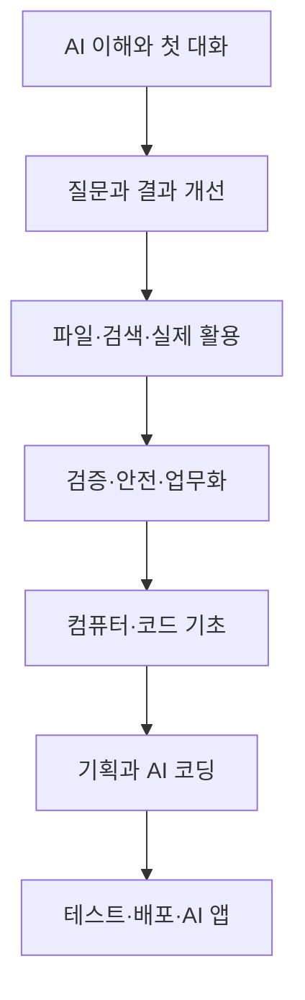
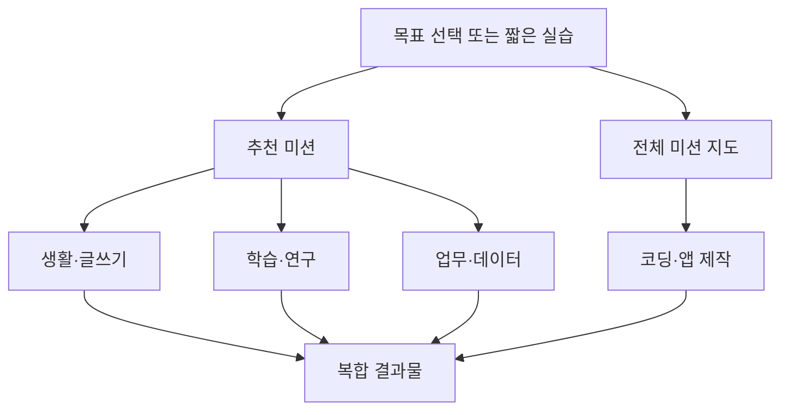

# CURRICULUM — 미션 콘텐츠 마스터 뱅크

> 전자책·유료 강의·영상을 조사해 뽑은 24개 원본 영역을 12단계로 재구성한 전체 커리큘럼과,
> 그중 v1(최초 검증 버전)으로 만들 18개 미션. **이 문서는 장기 콘텐츠 참고 자료다.**
> 지금 당장 전부 구현하지 않는다 — PROJECT.md 1-1 "미션 구성" 참고.
>
> PD1(검증 비용의 역설, PROJECT.md 11절)을 피하기 위해: 18개 중에서도 처음엔 3개 정도만
> 실제로 구현하고 실사용자에게 검증한 뒤 나머지를 추가한다.

---

## 1부. 전체 12단계 (장기 로드맵)

전체 원본 풀은 12단계로 나누는 것이 가장 자연스럽다. 여기서 12단계는 미션 12개라는 뜻이
아니라, 각 단계 안에 여러 미션이 들어가는 **학습 구간**이다.

| 단계 | 목표 |
|---|---|
| 1 | AI가 무엇인지 알고 처음 대화하기 |
| 2 | 원하는 결과를 질문으로 받아내기 |
| 3 | 대화를 이어가며 글·학습·아이디어 완성하기 |
| 4 | 파일·검색·이미지·데이터 활용하기 |
| 5 | AI 결과를 검증하고 안전하게 사용하기 |
| 6 | 업무에 적용하고 반복 작업으로 만들기 |
| 7 | 컴퓨터의 기본 구조 이해하기 |
| 8 | 코드의 기본 문법 이해하기 |
| 9 | 웹·앱의 구조를 이해하고 기획하기 |
| 10 | AI와 함께 코드 작성하기 |
| 11 | 오류 수정·테스트·저장·배포하기 |
| 12 | 실제 AI 기능이 있는 앱 만들기 |

### 1단계. AI와 처음 만나기

대상은 AI가 무엇인지 모르고 한 번도 사용하지 않은 사람.

**들어갈 요소:** AI/생성형 AI/머신러닝/LLM의 차이 · 다음 내용을 예측하는 원리 · 사람처럼
이해하는 게 아니라는 점 · 검색엔진과 대화형 AI의 차이 · 텍스트/이미지/음성/영상 AI의 차이 ·
챗봇/자동화/에이전트의 차이 · 잘하는 일과 못하는 일 · 계정 생성과 로그인 · 무료/유료 요금제 ·
모델과 작업 모드 개념 · 첫 질문 입력 · 후속 질문과 새 대화의 차이 · 대화 기록 확인/삭제/정리 ·
거부/오류/한도 대응

**완성 결과:** 자기소개 요청해보기 · 모르는 개념 하나 쉬운 말로 설명받기 · 후속 질문 한 번 해보기

**근거:** 처음부터 프롬프트 기술을 가르치면 무엇을 위해 배우는지 알 수 없다. 먼저 AI가
무엇이며 대화하면 어떤 결과가 나오는지 직접 경험해야 한다.

### 2단계. 원하는 결과를 질문으로 받아내기

**들어갈 요소:** 목표 명확히 말하기 · 상황/배경 설명 · 원본 자료 제공 · 결과물 사용 대상 지정 ·
조건/제외 조건 제시 · 형식 지정(길이/표/목록) · 말투/난이도 지정 · 예시 보여주기 · 역할/관점
부여 · 한 질문에 너무 많은 작업 안 섞기 · 복잡한 요청을 작게 나누기 · 정보 부족하면 AI가
먼저 묻게 하기 · 예시 유무 비교 · 모호/장황한 질문 고치기 · 지시 무시할 때 표현 바꿔 재요청

**일상 활용:** 음식/레시피 · 식단/예산/장보기 · 여행 · 쇼핑 비교 · 운동/생활 습관 · 일정/할 일 ·
선택지 비교 · 기준별 후보 평가 · 새 취미/기술 계획 · 개인 문제 해결책 · 안내문/계약 쉽게 설명 ·
문자/문의 작성

**완성 결과:** 맞춤 추천 · 개인 일정표 · 조건별 비교표

**근거:** 초보자는 추상적인 '프롬프트 공식'보다 내 조건에 맞는 결과가 달라지는 경험을 먼저
해야 질문의 구성 요소를 이해할 수 있다.

### 3단계. 대화로 결과를 발전시키기

**대화 개선:** 첫 답변 그대로 안 쓰기 · 짧게/쉽게/자세히 요청 · 부분 재작성 · 말투/구성/대상
변경 · 여러 대안 비교 · 장단점/빠진 점 찾기 · 반대 의견 요청 · 초안 비판시키기 ·
계획→초안→검토→수정→완성 · 단계마다 사람 확인 · 자기 기준으로 최종 선택 · AI는 대리인이
아니라 협력자

**글쓰기·의사소통:** 주제/개요 · 이메일/문자/공지 · 보고서/제안서/기사 · 긴 글 구성 ·
문법/가독성 · 요약/확장 · 말투 변경 · 독자별 재작성 · 번역/현지화 · 발표 대본 · 슬라이드 ·
웹 문구 · SNS/뉴스레터 · 긴 콘텐츠 분할 · 자기 경험 넣어 독창성 유지 · 여러 문서 문체 통일

**학습:** 수준별 설명 · 비유/사례 · 맞춤 학습계획 · 핵심 개념/암기카드 · 퀴즈/모의시험 ·
정답 대신 힌트 · 채점/피드백 · 틀린 이유 찾기 · 대화형 개인 교사 · 면접/발표/외국어 연습 ·
단계적 학습 · AI 의존 없이 직접 사고 · 과제 허용 범위 확인

**아이디어·의사결정:** 브레인스토밍/마인드맵 · 관점별 평가 · SWOT류 분석 · 선택지 점수화 ·
실행 계획 · 실제 문제 해결 확인 · 반대 의견 찾기 · 아이디어 변형 · 최종 판단 이유 기록

**완성 결과:** 이메일/보고서/발표자료 · 개인 학습계획 · 검토·수정 거친 최종 문서

**근거:** AI 활용 능력은 완벽한 질문을 한 번에 쓰는 능력보다 첫 결과를 보고 계속 수정하는
능력에 가깝다.

### 4단계. 파일·검색·미디어·데이터 활용하기

**기능:** 파일/PDF/사진/스크린샷 첨부 · 음성 대화 · 웹 검색/최신 정보 · 심층 조사 · 이미지
생성/수정 · 별도 작업 공간 편집 · 입력 방식 선택

**검색·연구:** 조사 질문 구체화 · 키워드 · 최신 정보와 일반 지식 구분 · 자료 수집/정리 ·
문서 요약 · 여러 문서 비교 · 주장/근거/반론 추출 · 조사 개요 · 문헌 분류 · 빈틈 찾기 · 보고서
작성 · 출처/인용 정리 · 재검토 · 원문 확인

**이미지·창작:** 화풍/구도/색상 지정 · 부분 수정 · 로고/썸네일 · 영상 대본/장면 · 스토리보드 ·
음악/효과음 아이디어 · 발표 시각자료 · 이미지 속 정보 질문 · 어색한 부분 확인 · 여러 AI 연결

**파일·데이터:** 문서/표/이미지 정보 추출 · 긴 문서 요약/질의응답 · 파일 비교 · 회의록에서
결정/할 일 추출 · 학습 노트 변환 · 표 정리 · 누락/중복 찾기 · 감정 분석 · 수식 생성 · 패턴 설명 ·
그래프/시각화 · 쉬운 말 설명 · 품질/방식 검토 · 민감 파일 업로드 판단

**완성 결과:** PDF 요약본 · 출처 있는 조사 보고서 · 데이터 분석표/그래프 · 이미지/영상 기획물

**근거:** 텍스트 대화에 익숙해진 뒤 입력 범위를 확장해야 목적에 맞게 사용할 수 있다.

### 5단계. 결과를 검증하고 안전하게 사용하기

**정확성 검증:** 자신 있게 틀릴 수 있음 · 사실/의견/추측 구분 · 근거/출처 요구 · 직접 확인 ·
출처 실존 확인 · 작성 날짜 확인 · 교차 검증 · 빠진 맥락 확인 · 편향 전제 확인 · 조건 바꿔
재질문 · 계산/코드 직접 실행 확인 · 불확실 표시 요청 · 체크리스트 평가 · 수정 요청 ·
의료/법률/금융은 AI 단독 결정 금지 · 최종 책임은 사람

**개인정보·윤리:** 민감정보 입력 주의 · 비공개 자료 업로드 금지 · 정보 제거/가리기 · 저장·이용
설정 확인 · 저작권 · 표절 구분 · 사용 사실 표시 · 자기 표현 유지 · 편향 · 접근성 · 허위정보/
딥페이크 · 책임 소재 · 자동화의 사회적 영향 · 공정성/투명성 · 조직 정책 준수 · 가드레일 ·
사용 원칙 작성/공개

**근거:** 고급 기능/자동화로 넘어가기 전에 AI를 믿어도 되는지 판단하는 능력이 필요하다.

### 6단계. 업무 적용과 반복 작업 만들기

**업무·취업·사업:** 이메일 정리 · 회의록/후속 업무 · 프로젝트 일정 · 반복 문서 · 보고서/발표 ·
고객 문의 · 시장 조사 · 마케팅 문구 · 이력서/자소서 · 채용 공고 분석 · 면접 연습 · 개인 브랜드 ·
데이터 분석 · 표준 작업 과정

**도구 선택:** 도구 비교 · 목적별 도구 선택 · 정확도/속도/가격 비교 · 개인정보/보안 비교 ·
무료/유료 구분 · 같은 작업 비교 · 목적 없는 수집 금지 · 용어 따라가기 · 모델 설정 이해

**개인화·반복·자동화:** 프로젝트별 관리 · 메모리/맞춤 지침 · Custom GPT · 프롬프트 저장 ·
변수형 양식 · 워크플로화 · 문서/이메일 연결 · 예약 작업 · 에이전트 기본 · 범위/중단 조건 ·
사람 검토 단계 · 업데이트 대응

**완성 결과:** 재사용 프롬프트 · 반복 업무 워크플로 · 맞춤 AI

**근거:** 직접 제대로 못한 작업을 자동화하면 오류를 판단할 수 없다. 수행→검증→반복 작업화
순서가 필요하다.

### 7단계. 컴퓨터와 디지털 기초

하드웨어/소프트웨어/OS · 브라우저/웹/앱 차이 · 파일/폴더/확장자 · 저장/복사/이동 · 압축 ·
경로/현재 위치 · 설치/삭제 · 다운로드 주의 · 코드 편집기 vs 문서 편집기 · 터미널/명령어/셸 ·
인터넷/서버/네트워크 기본 · 계정/권한/보안 · 오류 메시지 전달법 · 백업/버전관리 필요성

**근거:** 코딩 초보가 가장 먼저 막히는 건 문법이 아니라 파일 위치·설치·경로·터미널이다.

### 8단계. 코드의 기본 문법 이해하기

코드/프로그램의 의미 · 실행 순서 · 언어와 문법 · 주석 · 입출력 · 변수/값 · 자료형 · 연산자 ·
조건문 · 반복문 · 함수/매개변수 · 배열 · 객체/키값 · 모듈 · 문법 오류 vs 논리 오류 · 이름
짓기 · 기능 분리 · 리팩터링 · 객체지향 기초 · 라이브러리/프레임워크/의존성

**완성 결과:** 간단한 계산기 · 조건별 프로그램 · 반복문 활용 퀴즈/목록

**근거:** 문법 암기가 아니라, AI가 만든 코드를 검토하려면 변수/조건문/반복문/함수 정도는
읽을 수 있어야 한다.

### 9단계. 웹·앱의 구조 이해와 기획

**구조:** HTML/CSS/JS 구분 · 화면 요소/입력 · JS 이벤트 · 프론트/백엔드 · 서버/클라이언트 ·
HTTP 요청/응답 · API/JSON · 데이터베이스 · CRUD · 로그인/인증 · 외부 서비스 연결 · 호스팅/
클라우드 · 모바일 vs 웹앱 · 반응형/접근성 · 기술 스택 선택

**제품 기획:** 문제 찾기 · 사용자 정하기 · 핵심 기능 결정 · 필수/추가 구분 · 사용자 흐름 ·
화면 구성 · 성공 기준 · 범위 결정 · 개발 단위 분리 · 필요 데이터/API 확인 · 구조 계획 ·
보안/비용/유지보수 · 요구사항 문서

**완성 결과:** 요구사항 문서 · 화면 흐름/기능 목록 · 간단한 정적 웹페이지 설계

**근거:** 바이브 코딩 실패 원인은 코드 작성 능력보다 무엇을 만들지 불명확한 것.

### 10단계. AI와 함께 코드 작성하기

결과를 자연어로 설명 · 현재 코드/파일/오류/환경 제공 · 계획 먼저 요청 · 작은 기능부터 ·
생성 코드 역할 설명받기 · 비유로 설명받기 · 기존 기능 유지하며 부분 수정 · 범위 지정 ·
전후 비교 · 새 라이브러리 이유 질문 · 정확한 위치 확인 · 명령어 실행 전 의미 확인 · 요구사항
부합 판단 · 작업 기록해 다음 대화 제공 · 챗봇/코딩AI/코딩 에이전트 차이

**완성 결과:** 자기소개 웹페이지 · 타이머/퀴즈/할 일 목록 · 기능 추가해가는 동적 웹사이트

**근거:** 코딩 AI를 제대로 쓰는 능력은 현재 상태와 원하는 변경을 정확히 전달하는 능력.

### 11단계. 오류 수정·테스트·저장·배포

**오류·테스트:** 재현 · 오류 메시지 전체 전달 · 마지막 변경 확인 · 오류 종류 구분 · 원인 하나씩
검사 · 추측과 사실 구분 · 개발자 도구/로그 · 예상 vs 실제 비교 · 다양한 입력 테스트 · 단위
테스트 · 기존 기능 확인 · 코드 리뷰/보안 검토 · 코드 정리 · 문서화 · 사용자 피드백

**Git·보안·배포:** 백업 · Git/GitHub 역할 · 저장소/커밋/브랜치 · 의미 있는 저장 · 복구 · 병합 ·
PR/코드 검토 · 키/비밀번호 코드에 안 넣기 · 환경변수 · 입력/데이터 보호 · 인증 보안 · 의존성
위험 · 배포 · 도메인/호스팅 · 자동 테스트/배포 · 성능 확인 · 오류 감시 · 기존 기능 보호 · 확장

**완성 결과:** 테스트 거친 웹/앱 · GitHub 저장소 · 실제 배포 결과물

**근거:** 코드 생성과 사용 가능한 제품은 다르다. 수정/검증/복구/보안/배포까지 해야 완성.

### 12단계. AI 기능이 있는 앱 만들기

일반 프로그램 vs AI 앱 · AI API/모델 선택 · 시스템 지침 vs 사용자 질문 · 맥락 관리 · 대화
기록/메모리 · RAG · 도구 호출 · MCP 기본 · 단일/다중 에이전트 · 에이전트 권한 제한 · 입출력
검증 · 모델 평가 · 비용/속도/정확도 비교 · 프롬프트 공격 방지 · 가드레일 · 배포 전 테스트

**최종 결과물:** 파일 요약 도구 · 데이터 관리 앱 · 외부 API 앱 · PDF/청구서 생성기 · AI 개인
서비스 · 실제 배포 프로젝트

**근거:** '사용하는 사람'에서 'AI가 들어간 서비스를 만드는 사람'으로 넘어가는 지점.

### 전체 단계 흐름

- 1~2단계: AI에 대한 두려움을 없애고 빠르게 첫 효용을 경험
- 3~4단계: 대화와 다양한 기능으로 실제 결과물 제작
- 5단계: 결과를 믿어도 되는지 판단하는 능력 확보
- 6단계: 검증할 수 있는 작업을 반복 업무/자동화로 발전
- 7~8단계: 코딩 전 디지털·문법 기초
- 9~10단계: 만들 것을 설계하고 AI와 코드 작성
- 11단계: 생성된 코드를 실제 사용 가능한 결과물로 완성
- 12단계: AI 자체가 기능으로 들어간 서비스 제작

### 원본 24개 영역 → 12단계 배치 (누락 없음 확인)

| 기존 원본 영역 | 배치된 단계 |
|---|---:|
| 1. AI 기본 개념 | 1, 5, 6 |
| 2. 첫 사용과 기능 | 1, 4, 5, 6 |
| 3. 질문 작성법 | 2, 6 |
| 4. 대화 개선 | 3 |
| 5. 일상 활용 | 2 |
| 6. 글쓰기 | 3 |
| 7. 학습 | 3 |
| 8. 검색·연구 | 4 |
| 9. 아이디어·의사결정 | 3 |
| 10. 이미지·미디어 | 4 |
| 11. 파일·데이터 | 4 |
| 12. 업무·취업·사업 | 6 |
| 13. 도구 선택·자동화 | 6 |
| 14. 정확성·품질 관리 | 5 |
| 15. 개인정보·윤리 | 5 |
| 16. 컴퓨터 기초 | 7 |
| 17. 코드 개념·문법 | 8 |
| 18. 웹·앱 구조 | 9 |
| 19. 개발 기획 | 9 |
| 20. AI 코딩 | 10 |
| 21. 오류·테스트 | 11 |
| 22. Git·보안·배포 | 11 |
| 23. AI 앱 심화 | 12 |
| 24. 실전 결과물 | 2, 3, 4, 6, 8, 10, 11, 12 |

24개 원본 영역 전부 최소 한 단계 이상에 배치됨.

---

## 2부. 장기 미션 지도 구조 (v1 이후, 지금 구현 안 함)

가장 적합한 구조는 **"목표별 허브 + 필요한 만큼만 연결된 미션 지도"** — 일직선도, 스킬
트리도 아니다.

### 구조 비교

| 구조 | 방식 | 장점 | 문제점 |
|---|---|---|---|
| 자유 허브형 | 분야를 바로 선택 | 자유도 높음 | 완전 초보는 뭘 골라야 할지 모름 |
| 목표별 퀘스트형 | 결과를 먼저 선택 | 필요한 것만 빠르게 | 공통 능력이 여러 경로에서 중복 |
| 스킬 트리형 | 선행 능력 깨면 해금 | 성장 관계 명확 | 불필요한 선행 강요 가능 |
| 적응형 추천 | 짧은 실습으로 추천 | 사용자별 출발점 다름 | 판정/추천 로직 필요 |
| 선택 완료형 | N개 중 M개면 해금 | 선택권+진행감 | 필요한 내용을 건너뛸 수 있음 |

### 추천: 적응형 허브 미션 지도

1. 목표를 먼저 선택한다
2. 짧은 실습으로 이미 아는 내용을 건너뛴다
3. 정말 필요한 경우에만 선행 미션을 건다
4. 추천 경로와 자유 선택을 동시에 제공한다

### 선행 미션 예시 (최소한만 사용)

| 목표 미션 | 필요한 선행 능력 |
|---|---|
| 출처가 있는 조사 보고서 | 검색하기 + AI 답변 검증 |
| 데이터 분석 | 파일 첨부 + 표 이해 |
| AI와 웹사이트 만들기 | 파일·폴더 + 웹 구조 |
| 앱 배포하기 | 오류 테스트 + Git + 보안 |
| AI 앱 만들기 | API + 코드 구조 + 개인정보 보호 |

이미 아는 사용자는 선행 미션 대신 **짧은 통과 실습**으로 바로 해금. 사용자를 초급/중급/고급
으로 고정하지 않고 **능력마다 아는 정도를 따로 판단**.

### 완전 초보가 길을 잃지 않는 장치

첫 화면엔 선택지를 많이 보여주지 않고 세 개만: **추천 미션 시작 / 만들고 싶은 결과 선택 /
전체 미션 보기**.

### 12단계의 역할 재정의

12단계는 사용자에게 강제하는 순서가 아니라, **각 미션의 난이도·필요 관계를 정하는 내부
기준**으로 쓴다. 예: `2단계 수준` = 맞춤 메뉴 추천, `8단계 수준` = 조건문 이해. 사용자에게
"당신은 3단계"라고 표시하지 않는다 — 분야마다 수준이 다를 수 있다.

### 추가 고려 요소 (v1 이후)

5개 중 3개 완료 · 빠른 통과 · 복합 미션 · 추천 새로고침 · 도움 강도 선택(힌트만/단계별/거의
같이) · 도전 미션(선행 생략, 막히면 기초 추천)

**⚠️ 이 구조는 계정+DB(사용자별 능력 상태 저장)가 필요하다.** PROJECT.md 4절의 "저장소는
마지막 Phase만" 확정 사항과 충돌한다 — v1(18개 중 3개) 검증 전까지는 착수하지 않는다.

---

## 3부. v1 — 최초 검증 버전 (18개 미션)

**최소 미션 수는 18개.** 이보다 적으면 일부 분야가 미션 1개짜리 장식이 되거나, 코딩을 너무
급하게 건너뛰게 된다. 원본 풀 전체를 버리는 게 아니라, 먼저 18개로 미션 시스템이 실제로
작동하는지 검증하고 나머지를 추가하는 방식이다.

**⚠️ 18개 전부를 지금 만들지 않는다.** 이 중 3개 정도만 먼저 구현해 실사용자 검증 후
나머지를 추가한다 — 어느 3개인지는 PROJECT.md 1-1 참고.

### 1. AI 시작 — 4개

| 미션 | 실제로 하는 일 |
|---|---|
| 1. AI에게 첫 질문 보내기 | 궁금한 것을 직접 질문하고 후속 질문하기 |
| 2. 내 조건에 맞는 답 받기 | 상황·조건·원하는 형식을 추가해 결과 비교 |
| 3. 별로인 답변 고쳐보기 | 더 짧게, 쉽게, 다른 말투로 수정 요청 |
| 4. AI의 틀린 답 잡아내기 | 의심되는 내용을 찾고 출처와 재확인 요구 |

**근거:** 모든 분야에서 공통으로 사용하는 `질문→수정→검증`을 한 번씩 경험해야 한다. 이미
아는 사용자는 빠른 실습으로 통과할 수 있다.

### 2. 생활·글쓰기 — 2개

| 미션 | 실제로 하는 일 |
|---|---|
| 5. 내 조건에 맞는 메뉴·일정 만들기 | 예산·시간·취향을 넣어 계획 완성 |
| 6. 보내기 어려운 문장 다듬기 | 실제 문자나 이메일의 말투와 내용을 수정 |

**근거:** AI의 효과를 가장 빠르게 체감할 수 있고, 대부분의 사용자가 바로 활용할 수 있다.

### 3. 학습·연구 — 2개

| 미션 | 실제로 하는 일 |
|---|---|
| 7. 어려운 개념 제대로 이해하기 | 쉬운 설명→비유→퀴즈→오답 피드백 |
| 8. 출처가 있는 비교 조사하기 | 두 선택지를 조사하고 근거·출처 확인 |

**근거:** 단순히 답을 받는 사용과, AI를 교사·연구 보조로 활용하는 사용을 각각 확인한다.

### 4. 파일·창작·데이터 — 3개

| 미션 | 실제로 하는 일 |
|---|---|
| 9. PDF 핵심 내용 정리하기 | 파일을 첨부해 요약·질문·할 일 추출 |
| 10. 원하는 이미지 완성하기 | 구도·색상·스타일을 지정하고 수정 반복 |
| 11. 표에서 의미 찾아내기 | 간단한 데이터를 정리하고 그래프·해석 생성 |

**근거:** 파일, 이미지, 데이터는 입력 방식과 결과물이 서로 달라 최소 한 개씩 필요하다.

### 5. 업무·자동화 — 2개

| 미션 | 실제로 하는 일 |
|---|---|
| 12. 회의 내용을 실행 목록으로 바꾸기 | 회의록에서 결정 사항·담당 업무·기한 추출 |
| 13. 반복 업무용 AI 양식 만들기 | 자주 하는 작업을 재사용 가능한 프롬프트로 제작 |

**근거:** 한 번 사용하는 AI와 반복적으로 시간을 절약하는 AI의 차이를 보여준다. 에이전트나
완전 자동화는 이후에 추가해도 된다.

### 6. 코딩·앱 제작 — 4개

| 미션 | 실제로 하는 일 |
|---|---|
| 14. 웹페이지의 세 가지 재료 찾기 | HTML·CSS·JavaScript와 파일·폴더 역할 이해 |
| 15. AI와 웹페이지 바꾸기 | 제목·색상·버튼 등을 작은 단위로 수정 |
| 16. 원하는 기능 하나 추가하기 | 계산·목록·클릭 동작 중 하나 구현 |
| 17. 고장 난 코드 되살리기 | 오류 메시지를 전달하고 원인 확인·수정·실행 |

**근거:** 코딩은 `구조 이해→수정→기능 추가→오류 해결`을 모두 경험해야 한다. 앱 하나를
통째로 생성하는 미션 하나만 두면 코드를 배웠다고 보기 어렵다.

### 7. 복합 결과물 — 1개

| 미션 | 실제로 하는 일 |
|---|---|
| 18. 나만의 결과물 완성하기 | 배운 분야 두 개 이상을 연결해 하나의 결과물 제작 |

선택 예시: PDF+학습 → 나만의 공부 자료 / 조사+글쓰기+이미지 → 발표자료 / 생활+비교 →
여행 계획서 / 코딩+데이터 → 간단한 분석 도구

**근거:** 개별 기능을 사용한 것과 실제 목적을 달성한 것은 다르다. 마지막 미션은 모든
사용자가 같은 결과물을 만드는 방식이 아니라, 자신이 배운 분야를 연결하는 선택형이어야 한다.

### 18개 요약

공통 능력 4 · 생활·글쓰기 2 · 학습·연구 2 · 파일·창작·데이터 3 · 업무·자동화 2 ·
코딩·앱 제작 4 · 복합 결과물 1 = **총 18개**

18개를 일직선으로 진행시키는 것은 아니다. 처음에는 추천 미션 하나를 보여주고, 사용자는
관심 분야로 바로 이동한다. 선행 관계는 `코딩 구조→코드 수정→기능 추가`처럼 실제로 필요한
곳에만 적용한다 — 단, 이 선행/추천 로직 자체가 2부의 적응형 허브 구조이므로 v1(3개)
단계에서는 적용하지 않는다.
